# Studies in the News - Workflow Diagrams and Visualizations

This document contains various diagrams and visualizations for the Studies in the News newsletter workflow, including current processes, AI enhancement opportunities, and organizational structure.

## 0. **Current Workflow Diagram**

```mermaid
flowchart TD
    A[Scouts Monitor News & Draft Entries - Mon–Thu] -->|Fri Noon| B[Guest Editor Compiles Draft in Template]
    B --> C{Proofreader & Manager Review - Mon}
    C -->|Edits Needed| D[Guest Editor Revises & Finalizes Draft - Tue 10 AM]
    C -->|Approved as-is| D
    D --> E[MailChimp Formatting & Test Email - Tue PM]
    E --> F{Final Check by Team}
    F -->|Fix Needed| E
    F -->|OK| G[Newsletter Sent - Wed 8 AM]
    G --> H[Guest Editor Logs Issue Data in Excel]
```




## 1. Enhanced Workflow Diagram with AI Opportunities

Based on the current workflow and identified AI enhancement opportunities:


## 2. Weekly Timeline and Schedule


## 3. Roles and Responsibilities Matrix


## 4. AI Enhancement Opportunities Matrix


## 5. Detailed Process Flow with Decision Points


## 6. Implementation Phases for AI Enhancements

```mermaid
timeline
    title AI Implementation Roadmap

    section Phase 1: Pilot - Months 1-3
        Low-friction wins           : News filtering model
                                   : Rubric checker prototype
                                   : AI-generated newsletter template

    section Phase 2: Scaling - Months 4-6
        Standardization            : Bias detection dashboard
                                   : Automated draft generation
                                   : Scout workflow integration

    section Phase 3: Optimization - Months 7-9
        Strategic insight          : Policy coverage analytics
                                   : CA relevance scoring
                                   : Training chatbot for new scouts

    section Phase 4: Sustainability - Months 10-12
        Continuous improvement     : Automated action item capture
                                   : Iterative rubric refinement
                                   : Periodic process reviews
```

## 7. Current vs. Enhanced Workflow Comparison


## Key Insights from the Diagrams

1. **Workflow Efficiency**: The current workflow has multiple manual steps that can be enhanced with AI, particularly in content discovery, quality control, and compilation phases.

2. **Timeline Pressure**: The Friday-to-Wednesday production cycle creates time pressure points that AI can help alleviate through automation and faster processing.

3. **Quality Consistency**: AI rubric enforcement can address the current inconsistency in study vetting across different scouts.

4. **Scalability**: The rotating guest editor role and manual processes limit scalability, which AI enhancements can address.

5. **Feedback Loops**: The current system has limited feedback mechanisms that AI analytics can significantly improve.

These diagrams provide a comprehensive visual representation of the Studies in the News workflow, highlighting both current processes and opportunities for AI enhancement to improve efficiency, consistency, and quality.
